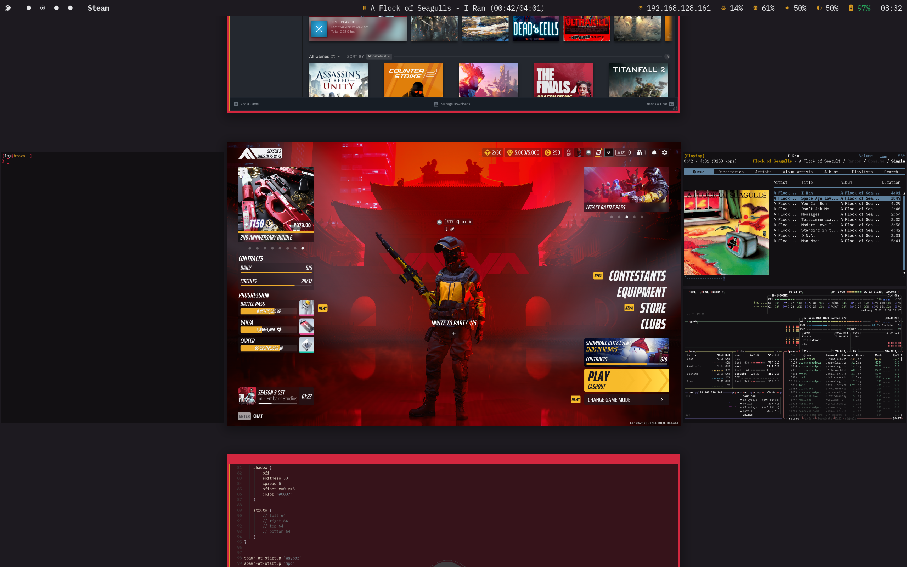

# Hroza Dotfiles

My personal config files for a Gentoo Linux setup.



## System Overview
- **OS:** Gentoo Linux
- **Window Manager:** [Niri](https://github.com/YaLTeR/niri) (a scrollable tiling Wayland compositor)
- **Status Bar:** [Waybar](https://github.com/Alexays/Waybar)
- **Terminal:** [Foot](https://codeberg.org/dnkl/foot)
- **Music:** [MPD](https://www.musicpd.org/)
- **Hardware:** Intel Raptor Lake

## Repository Structure
Configs are laid out to match the system paths:
- `config/`: Stuff for `~/.config/`.
  - `foot/`: Terminal settings.
  - `mpd/`: MPD config.
  - `niri/`: Window manager files.
  - `waybar/`: Bar layout and modules.
- `etc/portage/`: Gentoo Portage tweaks.
  - Covers `make.conf`, package masks/unmasks, and USE flags for Raptor Lake with Nvidia.

## Installation
> [!WARNING]
> These are tuned for my hardware and habits—double-check before copying to your setup.

Link the user configs to `~/.config/`:
```bash
ln -s $(pwd)/config/* ~/.config/
```

For Portage files, merge them into `/etc/portage/` carefully.
